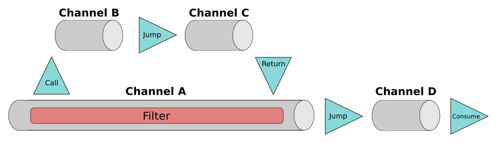
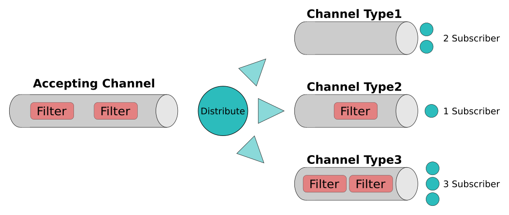

# MessageMaid
MessageMaid is a library for building messaging architectures.

It provides components to integrate parts of your business 
logic in a loosely coupled fashion. This allows for applications to be highly
extensible and easily tested.

## Maven Dependency
[](https://maven-badges.herokuapp.com/maven-central/de.messagemaid.messagemaid/core)
```
<dependency>
    <groupId>de.quantummaid.messagemaid</groupId>
    <artifactId>core</artifactId>
    <version>...</version>
</dependency>
```

## Motivation
Messaging is a form of communication, that exchanges encapsulated messages between 
parts of an application or different applications. In contrast to other types of 
integration it models both the carrier and the send messages as distinct
concepts of the application. This can provide several benefits if used correctly. But it 
can also generate overhead and complexity. This library focuses on a lightweight 
implementation of messaging patterns to be wire use cases and objects within one application. 
For integrating different applications (over network, shared memory, ...) other libraries exist.

This library provides implementations for typical forms of message carriers like 
Channels or MesssageBus. Explicitly modelling these transport mechanisms as distinct
objects have an beneficiary influence on the coupling of independent parts of the 
application. When parts of the application want to communicate with each other, they
send messages. The sender puts its message on the MessageBus. The MessageBus then 
ensures, that the message is delivered to all subscribers. The sender does not need to know
the number or type of the subscribers. The subscribers have no knowledge about the sender.
This leads to a very loosely coupled integration. As sender and subscriber can be added or 
removed dynamically during runtime, the application becomes very flexible. 

Both, MessageBus and Channel, can be configured to provide asynchronous aspects using 
Threads. This simplifies code using these objects, as a lot of asynchronous 
and synchronization problems are already solved. Dynamically scaling out Threads only 
required to change the configuration Channels and MessageBus. The rest of the application
can remain mostly agnostic to it. 

These messaging patterns ease the integration of Frameworks with the application's use cases.
But also the communication between use cases is greatly simplified with a MessageBus. Even
at the scope of Domain Objects messaging patterns can provide loosely coupling and dynamism.

## Installation
To use MessageMaid add the following Maven depedency to your 'pom.xml`:
```java
<dependency>
    <groupId>de.quantummaid.messagemaid</groupId>
    <artifactId>core</artifactId>
    <version>1.0.2</version>
</dependency>
```

## Basic Concepts

### Channel
A common task in message driven architectures is sending messages from a bunch of producers to 
an arbitrary amount of consumers, handling errors and allowing to add Filters dynamically.
In MessageMaid Channels provide these kind of properties:
 - add or remove sender and receiver dynamically
 - define the type of send messages, when sender and receiver have agreed on the format of the send messages
 - change the messages during the transportation via Filter: changing the contents of the message, blocking invalid messages,...
 - abstract configuration: once the Channel is created, the participants should be agnostic about the used configuration, e.g. whether the Channel is asynchronous
 - dynamic extension points: add Filter, add logging or even replace the subscriber during tests
 - monitoring: get information about the number of messages that got delivered successful, blocked or failed with exceptions
 
#### Creating a Channel
Channels can be created using the `ChannelBuilder` class:

```java
Channel<TestMessage> channel = ChannelBuilder.aChannel(TestMessage.class)
    .forType(ChannelType.SYNCHRONOUS)
    .withDefaultAction(Consume.consumeMessage(m -> {
        System.out.println(m);
    }))
    .build();

channel.send(new TestMessage());
```
Channels can be of type `SYNCHRONOUS` (which is the default) or of type `ASYNCHRONOUS`.
Synchronous Channels will execute the delivery on the Thread calling `send`. Asynchronous
Channels bring their own Threadpool with them. For more details on how to create and configure
asynchronous Channels see [Configuring the Channel](#Configuring-the-Channel)

At the end of a Channel an Action is executed for each message. Actions abstract
the consumer part of the messaging. The simplest Action is the `Consume` Action 
which executes the given logic for each message that reached the end of the Channel. 
Other Actions allow dynamic subscriptions or jumps to other Channels.

#### Actions
Each message reaching the end of the Channel will be consumed by an Action. This can
be the default Action defined during creation time or a dynamically changed by Filter 
(explained below). Several default Actions exist:

##### Consume
A `Consume` Action calls the given Consumer function for every message that reached
the end of the Channel:

```java
Action<T> action = Consume.consumeMessage(processingContext -> {
    T payload = processingContext.getPayload();
    System.out.println(payload);
});
```

A shortcut exists, if only the payload is needed: 
```java
Action<T> action = Consume.consumePayload(payload -> {
    System.out.println(payload);
});
```

##### Subscription
The `Subscription` Action extends the `Consume` Action with the ability of having 
several consumers, called Subscriber. The `Subscription` Action allows adding and
removing Subscriber dynamically:

```java
Subscription<Object> subscription = Subscription.subscription();

Consumer<Object> consumer = message -> System.out.println(message);

SubscriptionId subscriptionId = subscription.addSubscriber(consumer);

subscription.removeSubscriber(subscriptionId);

Subscriber<Object> subscriber = ConsumerSubscriber.consumerSubscriber(consumer);
SubscriptionId subscriptionId = subscription.addSubscriber(subscriber);
subscription.removeSubscriber(subscriber);

boolean notEmpty = subsription.hasSubscribers();
``` 
The `addSubscriber` method is overloaded to accept either a java Consumer or 
a `Subscriber` object. Classes implementing this interface get more control 
over the management of the SubscriptionId or the acceptance of messages, e.g. 
they can preempt the delivery, so that other subscriber do receive the message. 
See [Subscriber](#Subscriber) for more details. The `addSubscriber` methods returns a `SubscriptionId`, 
which is an unique UUID generated for each `Subscriber`. It can be used to uniquely 
identify a Subscriber. The `removeSubscriber` method makes use of this to remove
subscriptions.

##### Jump
In more complex messaging architectures larger processing logics are often split 
into smaller, logical pieces by chaining Channels. Each Channel is then responsible
for a smaller part in this flow. These Channels can be connected via `Jump`
Actions. A `Jump` Action takes a message and sends it on the next Channel:

```java
Channel<T> nextChannel = ...;
Jump<T> jump = Jump.jumpTo(nextChannel);
```

The reason to use `Jumps` and not a `Consume` calling `send` on the next Channel is 
the control structure used in Channels. Messages send over Channels are
enveloped in `ProcessingContext` objects. These context objects contain history information
over past Channels useful for debugging.
The `Jump` Action handles these context information during the change of Channels
(For more information about the `ProcessingContext` object see [Processing Context](#Processing-Context)).

##### Adding Filter to Channel
Channels provide an extensible mechanism for processing messages: Filter.
A send message traverses all Filter before being consumed by the final Action.
Each Filter has two options: It can allow the message to pass or it can block the message.
A blocked message will stop its propagation through the remaining Filter and will never
reach the final Action:

```java
channel.addProcessFilter((processingContext, filterActions) -> {
    TestMessage message = processingContext.getPayload();
    if (isValid()) {
        message.validated = true;
        filterActions.pass(processingContext);
    } else {
        filterActions.block(processingContext);
    }
});
```
Calling `filterActions.pass` will propagate the message to the next Filter. 
`filterActions.block` will stop the propagation. If none of these methods are called,
the message is also blocked. But not calling the `block` method should be avoided as 
Filter should be written as explicit as possible (Also the message is marked as 
`forgotten` and not as `blocked` in the `ChannelStatistics`).

As mentioned earlier, each message is always enveloped in a `ProcessingContext` control structure.
To get access to the original message use `getPayload`. But the `pass` and
`block` methods again expect the `ProcessingContext` object. Filter can freely access the
`ProcessingContext` object. The most common usage would be to replace the Action, that
is executed at the Channel's end:

```java
channel.addPostFilter((processingContext, filterActions) -> {
    if(!processingContext.actionWasChanged()) {
        processingContext.changeAction(Consume.consumeMessage(m -> {}));
    }
});
```

Filter can be added at three different stages: Pre, Process, Post. These three different
extension points serve as coarse-grained ordering. All Filter in the Pre Stage are always
executed before the Filter in the Process stage, which themselves execute before the Post Filter.
Within these stages the order of Filter follows the contract of java's concurrent list.

For each of three stages methods exists to query registered Filter and to remove 
Filter:
```java
List<Filter<ProcessingContext<T>>> preFilter = channel.getPreFilter();
List<Filter<ProcessingContext<T>>> processFilter = channel.getProcessFilter();
List<Filter<ProcessingContext<T>>> postFilter = channel.getPostFilter();
        
channel.removePreFilter(filter);
channel.removeProcessFilter(filter);
channel.removePostFilter(filter);        
```

##### Call and Return
A special Action that can only be used inside a Filter is the `Call` Action. It is used
to perform an immediate jump to a different Channel. The transport of the message is
resumed the moment the other Channel executes a `Return` as it's final Action. This `Call`/`Return`
combination allows Filter to add arbitrarily complex logic dynamically to a Channel.

```java
Channel<TestMessage> differentChannel = ChannelBuilder.aChannel(TestMessage.class)
    .withDefaultAction(Return.aReturn())
    .build();

channel.addPostFilter((processingContext, filterActions) -> {
    Call.callTo(differentChannel, processingContext);
    System.out.println("Returned from other Channel.");
    filterActions.pass(processingContext);
});
```
`Calls` can be nested arbitrarily and don't need to return. But executing a `Return` without
a previous `Call` will result in an error.

The factory method `Call.callTo` executes the `Call` directly. If access to the `Call`
object is needed, a two step alternative exists:

```java
channel.addPostFilter((processingContext, filterActions) -> {
    final Call<TestMessage> call = Call.prepareACall(differentChannel);
    doSomethingWith(call);
    call.execute(processingContext);
});
```

Once a `Call` and its matching `Return` object was executed, both objects are linked to each other:
```java
//suppose these are the two related actions
Return<Object> returnAction = Return.aReturn();
Call<Object> callAction = Call.prepareACall(otherChannel);


ChannelProcessingFrame<Object> returnFrame = callAction.getReturnFrame();
assertThat(returnFrame.getAction(), equalTo(returnAction));

ChannelProcessingFrame<Object> callFrame = returnAction.getRelatedCallFrame();
assertThat(callFrame.getAction(), equalTo(callAction));

Channel<Object> callActionTargetChannel = callAction.getTargetChannel();
```

#### Channel Statistics
Each Channel provides basic logging in form of statistics itself: It logs the number of 
messages, that were
 - accepted: message was received by Channel and transport was started. A message is always
 accepted or an exception is thrown
 - queued: asynchronous Channel can queue messages, if no Threads are available. This statistic
 resembles the number of currently waiting messages
 - blocked: number of messages that were blocked by Filter
 - forgotten: number of messages that were neither passed nor blocked by Filter
 - successful: number of messages that passed all Filter and executed the final Action without error
 - failed: if an exception is thrown during a Filter or the final Action, the 
 message is marked as failed

 ```java
ChannelStatusInformation statusInformation = channel.getStatusInformation();
ChannelStatistics statistics = statusInformation.getChannelStatistics();
BigInteger acceptedMessages = statistics.getAcceptedMessages();
BigInteger queuedMessages = statistics.getQueuedMessages();
BigInteger blockedMessages = statistics.getBlockedMessages();
BigInteger forgottenMessages = statistics.getForgottenMessages();
BigInteger successfulMessages = statistics.getSuccessfulMessages();
BigInteger failedMessages = statistics.getFailedMessages();
Date timestamp = statistics.getTimestamp();
 ```
Each statistic contains a timestamp indicating the date, when the given numbers
were approximately valid.

#### Closing the Channel
Each Channel can be closed to free resources in case the Channel was stateful 
(Asynchronous Channels are stateful). The following methods exists:

```java
boolean finishRemainingTasks = true;
channel.close(finishRemainingTasks);

boolean closed = channel.isClosed();

try {
    boolean terminationSucceeded = channel.awaitTermination(5, MILLISECONDS);
} catch (InterruptedException e) {
    
}
```

These methods follow the contract, that classes from the standard java library with
these sort of methods abide to. Channel (as all closable Classes in MessageMaid) 
also implement the `AutoClosable` interface and can be used in a try-with-resources statement.

#### Configuring the Channel
Configuring a Channel is done using the respective `ChannelBuilder` class' methods.

```java
ChannelBuilder.aChannel()
.forType(ChannelType.ASYNCHRONOUS)
.withAsynchronousConfiguration(asyncConfig)
.withDefaultAction(Subscription.subscription())
.withChannelExceptionHandler(customExceptionHandler)
.withActionHandlerSet(customActionHandlerSet)
.build();
```

The available Actions were discussed in [Actions](#Actions)

##### Type
There exists two types of Channels: `ChannelType.SYNCHRONOUS`and `ChannelType.ASYNCHRONOUS`. Sending on synchronous
Channels is executed on the Thread calling `send`. Asynchronous Channels provide their
own Threads using a Threadpool. Asynchronous Channels require an additional 
`AsynchronousConfiguration`. 

There exists two convenience methods to ease the creation of a fitting asynchronous
configuration:

```java
int numberOfThreads = 5;
AsynchronousConfiguration.constantPoolSizeAsynchronousPipeConfiguration(numberOfThreads);
int maximumBoundOfQueuedMessages = 100;
AsynchronousConfiguration.constantPoolSizeAsynchronousPipeConfiguration(numberOfThreads, maximumBoundOfQueuedMessages);
```

In case a more fine-tuned configuration is needed, two constructor and getter are provided:
```java
AsynchronousConfiguration configuration = new AsynchronousConfiguration();
configuration.setCorePoolSize(5);

int corePoolSize = 5;
int maximumPoolSize = 10;
int maximumTimeout = 15;
TimeUnit timeUnit = MILLISECONDS;
LinkedBlockingQueue<Runnable> threadPoolWorkingQueue = new LinkedBlockingQueue<>();
new AsynchronousConfiguration(corePoolSize, maximumPoolSize, maximumTimeout, timeUnit, threadPoolWorkingQueue);
```
These configuration properties are identically to those available for the java ThreadPoolExecutor
class, as the asynchronous Channel uses such underneath. For a comprehensive documentation please consult 
the java doc of the ThreadPoolExecutor class.

##### ChannelExceptionHandler
The default exception behaviour is to throw each exception on the Thread it occurs on.
This might not be sufficient for a multi-threaded configuration. Therefore a custom 
exception handler can be set, that gets access to all internal exceptions.
```java
ChannelExceptionHandler<T> channelExceptionHandler = new ChannelExceptionHandler<T>() {
    @Override
    public boolean shouldSubscriberErrorBeHandledAndDeliveryAborted(ProcessingContext<T> message, Exception e) {
        boolean abortDeliveryAndHandleError = true;
        return abortDeliveryAndHandleError;
    }

    @Override
    public void handleSubscriberException(ProcessingContext<T> message, Exception e) {

    }

    @Override
    public void handleFilterException(ProcessingContext<T> message, Exception e) {

    }
};
```
When an exception occurs during the `accept` method of a subscriber, first the
`shouldSubscriberErrorBeHandledAndDeliveryAborted` method is called. This method
can decide whether the exception should count as such and the delivery should be aborted.
A `true` results in the message being marked as failed in the statistics.
No further subscriber gets the message delivered and the 
`handleSubscriberException` method is called in the end. Given a `false` the 
exception is ignored and the delivery continues normally.

In case of a Filter throwing an exception, the `handleFilterException` method is called.
An exception inside a Filter always counts as failed and aborts the propagation to 
subsequent Filter or any final Action.

##### ActionHandlerSet
Actions serve only as representative container for the information necessary to 
execute them. Any logic regarding their execution is handled by the `ActionHandlers`. 
This allows exchanging logic without changing Actions and makes debuging easier. The 
`ActionHandlerSet` contains one handler for each Action. 

When a message reaches the end of a Channel, the `ActionHandlerSet` serves as a 
lookup object for an `ActionHandler` matching the Channel's final Action. When a suitable 
handler is found, its `handle` method is called. When no handler is registered an exception is thrown.

```java
ActionHandlerSet<Object> defaultActionHandlerSet = DefaultActionHandlerSet.defaultActionHandlerSet();
defaultActionHandlerSet.registerActionHandler(CustomAction.class, new CustomActionHandler());
        
ChannelBuilder.aChannel()
.withActionHandlerSet(actionHandlerSet);
```

A more in depth explanation about writing custom Actions and `ActionHandlerSets` 
is given in [Custom Actions](#Custom-Actions).

#### Processing Context
Channels can be chained into arbitrary complex structures. The Channels are connected
via Actions (and Calls inside Filter). Filters within these Channels might share data or
the history might be of interest for debugging purpose. Since these type of information
should not be stored inside the payload itself, a wrapping context object is needed,
the `ProcessingContext`. 

Each message contains its own `ProcessingContext` object. It wraps the message's payload
and optional error payload. Each `ProcessingContext` creates
a new unique `MessageId` for each message. Additionally, an optional `CorrelationId` can
be set or derived from the `MessageId`. `CorrelationIds` are used heavily in combination 
with a `MessageBus` to link related messages to each other. Also more used in the context 
of a `MessageBus` is the `ProcessingContext's` `EventType`. The `MessageBus` explained 
later uses these `EventTypes` to decide, to which subscribers the current message should 
be routed. Each `ProcessingContext` also brings a meta data map from type
`Map<Object, Object>` to store additional data about the message, which does not belong
in the payload.

```java
T payload = processingContext.getPayload();
Object errorPayload = processingContext.getErrorPayload();
EventType eventType = processingContext.getEventType();
Map<Object, Object> metaData = processingContext.getContextMetaData();

MessageId messageId = processingContext.getMessageId();
CorrelationId correlationId = processingContext.getCorrelationId();
CorrelationId correlationIdForMessage = processingContext.generateCorrelationIdForAnswer();
assertTrue(correlationIdForMessage.matches(messageId));
```

The history of Channels is represented as a linked list of `ChannelProcessingFrames`.
This list includes a frame for each traversed Channel. Each frame contains a reference
to its previous and next frame and to its respective Channel. When a Channel is traversed
to its end, the actual final Action is also stored in the frame.
The `ProcessingContext` object serves as root object referencing the first, initial frame
and the frame of the currently traversed Channel.

```java
ChannelProcessingFrame<T> initialProcessingFrame = processingContext.getInitialProcessingFrame();
Channel<T> channel = initialProcessingFrame.getChannel();
ChannelProcessingFrame<T> previousFrame = initialProcessingFrame.getPreviousFrame();
ChannelProcessingFrame<T> nextFrame = initialProcessingFrame.getNextFrame();
Action<T> executedAction = initialProcessingFrame.getAction();
```

Calls are also included in the linked `ChannelProcessingFrames` list, although stored
a little bit differently. Let's suppose we have 4 Channels:
 - Channel A contains a Filter executing a Call to Channel B. The default Action of
 Channel A is a Jump to Channel D
 - Channel B is the target of the Call within Channel A. As default Action a Jump to
 Channel C is executed.
 - Channel C just executes a Return as Action returning the control to Channel A
 - Channel D is the last Channel with Consume as Action.
 
 
 
 
The linked list of `ChannelProcessingFrames` would consist of the following 5 entries:
1) a frame for Channel A with a Action `Call` as soon as the Call is executed
2) a frame for Channel B with the default Action `Jump` to Channel C
3) a frame for Channel C with the Action `Return` back to Channel A
4) a frame for Channel A with the default Action `Jump` to Channel D
5) a frame for Channel D with `Consume` as final Action 

So in general one frame is added per Channel, except for a Call. In this case an extra
`ChannelProcessingFrames` is added to indicate the branching of the flow.

Additionally the `ProcessingContext` object provides a MetaDataMap for sharing data between Channels 
or Filter.
```java
ProcessingContext<Object> processingContext = ProcessingContext.processingContext(message);

Map<Object, Object> metaData = processingContext.getContextMetaData();
```


### MessageBus
Channels are restricted to a specific type. This can be a benefit as the format of the 
communication between producer and consumer is defined by the Channel itself. But this solution 
comes short when several formats or communications are to be supported by the same
transport object.

The solution is a MessageBus. Any type of message can be send over a MessageBus. Subscribers
are then able to pick the type of messages they are interested in via type-based subscription.
This makes integrating distinct parts of an application possible.

A MessageBus is structured as follows:




Every message is accepted by the AcceptingChannel. The AcceptingChannel is responsible
for the configuration (synchronous or asynchronous) and can also contain Filter that
need access to all messages.
Messages, that passed the AcceptingChannel, are distributed into subscriber-specific 
Channels. Every `EventType`, which has at least on subscriber, corresponds to a Channel,
that delivers all message of its type to its subscribers. On this Channel Filter 
can be added, that are specific for all messages of this `EventType`.


#### Using the MessageBus

```java
MessageBus messageBus = MessageBusBuilder.aMessageBus()
    .forType(MessageBusType.SYNCHRONOUS)
    .build();


final EventType eventType = eventTypeFromString("requestX");
 SubscriptionId subscriptionId = messageBus.subscribe(eventType, o -> {
     System.out.println(o);
 });
        
 messageBus.send(eventType, new TestMessage());
        
messageBus.unsubcribe(subscriptionId);
```

The `MessageBusBuilder` is used to configure and create a MessageBus. 
The `subscribe` method is again overloaded to either aaccept a Subscriber or a java 
consumer. The first parameter defines the `EventType` of the subscription. 
All messages of this type are delivered to all subscribers for this type. 
The returned subscriptionId is used in case the subscriber should should be 
removed to not received any more messages.

As discussed in [ProcesscingContext](#Processing-Context) earlier, messages can
contain a `CorrelationId` to express, that a set of messages are related. The 
typical use case is sending a response/answer to a previous request. The
`MessageBus` allows sending and subscribing messages based on `CorrelationIds`.


```java
CorrelationId correlationId = CorrelationId.newUniqueCorrelationId();
messageBus.subscribe(correlationId, processingContext -> {
    Object payload = processingContext.getPayload();
    System.out.println(payload);
});

EventType eventType = EventType.eventTypeFromString("answerForX");
messageBus.send(eventType, new TestMessage(), correlationId);
```

The `CorrelationId` based subscriber gets access to the complete `ProcessingContext`
object, as it holds the `MessageId` and the `CorrelationId`. For the `EventType`
based `subscribe` function, a `subscribeRaw` version exists, in case the normal
subscriber needs access to the `ProcessingContext` object:


```java
messageBus.subscribeRaw(eventType, processingContext -> {
    Object payload = processingContext.getPayload();
    System.out.println(payload);
});
```


#### Adding Filter to the MessageBus
The MessageBus can add Filters, that get access to all messages:

```java
final Filter<Object> filter = new Filter<Object>() {
    @Override
    public void apply(Object message, FilterActions<Object> filterActions) {
        //filter logic
    }
};
messageBus.add(filter);

List<Filter<Object>> allFilter = messageBus.getFilter();

messageBus.remove(filter);
```

In case a more fine-grained filtering is needed, the MessageBus allows to query for
the specific Channel for a given tyoe. On this Channel Filter can be added as already
described in [Filter](#Adding-Filter-to-Channel)
```java
MessageBusStatusInformation statusInformation = messageBus.getStatusInformation();
Channel<TestMessage> channel = statusInformation.getChannelFor(eventType);
channel.addPreFilter(filter);
channel.addProcessFilter(filter);
channel.addPostFilter(filter);
```

In case the underlying `ProcessingContext` object is needed, an `addRaw` method 
is provided:

```java
messageBus.addRaw(new Filter<ProcessingContext<Object>>() {
    @Override
    public void apply(ProcessingContext<Object> processingContext, 
                      FilterActions<ProcessingContext<Object>> filterActions) {
        //filterLogic
    }
});
```

#### MessageBus Statistics
Similar to the Channel the MessageBus collects statistics about all messages:

```java
MessageBusStatusInformation statusInformation = messageBus.getStatusInformation();
MessageBusStatistics statistics = statusInformation.getCurrentMessageStatistics();
BigInteger acceptedMessages = statistics.getAcceptedMessages();
BigInteger queuedMessages = statistics.getQueuedMessages();
BigInteger blockedMessages = statistics.getBlockedMessages();
BigInteger forgottenMessages = statistics.getForgottenMessages();
BigInteger successfulMessages = statistics.getSuccessfulMessages();
BigInteger failedMessages = statistics.getFailedMessages();
Date timestamp = statistics.getTimestamp();
```

It's important to note, that these statistics count only for the accepting channel.
Once, the message is given to the type specific channel and the `CorrelationId` 
based subscribers, the result is no longer contained in the above statistics.
For instance, when a message has been successfully traversed the accepting channel
and was delivered to the type specific channel, it is marked als successful. Errors
in the type specific channel or the correlation based subscriber are not included.
The type specific statistic are collected as usual by the channel itself.

#### MessageBus Debug Information
the `MessageBusStatusInformation`interface provides useful debug information.
It allows to query the currently registered subscriber and error listener.

```java
MessageBusStatusInformation statusInformation = messageBus.getStatusInformation();
List<Subscriber<?>> allSubscribers = statusInformation.getAllSubscribers();
Map<Class<?>, List<Subscriber<?>>> subscribersPerType = statusInformation.getSubscribersPerType();
List<MessageBusExceptionListener<?>> exListener = statusInformation.getAllExceptionListener();
```

#### Closing the MessageBus
The methods to close the MessageBus are similar to those described for Channels in [Closing the Channel](#Closing-the-Channel):

```java
boolean finishRemainingTasks = true;
messageBus.close(finishRemainingTasks);

boolean closed = messageBus.isClosed();

try {
    boolean awaitSucceeded = messageBus.awaitTermination(5, SECONDS);
} catch (InterruptedException e) {

}
```

#### Configuring the MessageBus
All configuration is done using the `MessageBusBuilder` class. All configurable properties have default values. This creates
a synchronous MessageBus. The default `MessageBusExceptionHandler` throws all exceptions on the calling Thread. Whenever a
class specific Channel has to be created, a synchronous one is created by the default MessageBusChannelFactory. 

```java
MessageBusBuilder.aMessageBus()
.forType(MessageBusType.SYNCHRONOUS)
.withAsynchronousConfiguration(asynchronousConfiguration)
.withExceptionHandler(new MessageBusExceptionHandler() {
    @Override
    public boolean shouldDeliveryChannelErrorBeHandledAndDeliveryAborted(ProcessingContext<?> message, Exception e, Channel<?> channel) {
        final boolean abortDeliveryAndHandleException = false;
        return abortDeliveryAndHandleException;
    }

    @Override
    public void handleDeliveryChannelException(ProcessingContext<?> message, Exception e, Channel<?> channel) {

    }

    @Override
    public void handleFilterException(ProcessingContext<?> message, Exception e, Channel<?> channel) {

    }
})
.withAChannelFactory(new MessageBusChannelFactory() {
    @Override
    public <T> Channel<?> createChannel(Class<T> tClass, Subscriber<T> subscriber, MessageBusExceptionHandler messageBusExceptionHandler) {
        ChannelExceptionHandler<T> channelExceptionHandler = delegatingExceptionHandlerTo(messageBusExceptionHandler);
        return ChannelBuilder.aChannel()
            .withDefaultAction(Subscription.subscription())
            .withChannelExceptionHandler(channelExceptionHandler)
            .build();
    }
})
.build();
```

The type and the `AsynchronousConfiguration` are similar to those used for Channels 
described in [Configuring the Channel](#Configuring-the-Channel).

The default MessageBusExceptionHandler throws all exceptions. It can be replaced using
`withExceptionHandler` method. When an exception is thrown in one of the subscriber
the `shouldDeliveryChannelErrorBeHandledAndDeliveryAborted` is called to decide,
whether the exception should be handled and the delivery is aborted or whether the
exception should be ignored. In case the exception should be handled, the message
is marked as failed in the statistics and the `handleDeliveryChannelException`
method is called. When an exception is raised in any Filter (general or class
specific Channel), the delivery is aborted, the message is marked as failed and
the control is given to `handleFilterException`. After each of the `handle_Exception`
methods all suitable exception listener are called.

The `MessageBusChannelFactory` is used to create the class-specific Channel, that delivers the
messages to the Subscribers for this class. The default implementation creates a synchronous Channel,
that redirect errors to the `MessageBusErrorHandler`. But in case more control over the
configuration of these Channels is needed, a custom implementation can be given here. The 
creation of a new happen Channel can be requested in two cases: First a subscriber is added 
for a not yet known class. Second, an unknown message was sent. Then for the class of the message 
and all newly discovered parent classes, a new Channel is created.                                                                                        * discovered parent classes, a new {@code Channel} is created.
Care has to be taken to handle or redirect the errors correctly. Also important to note is,
that the `close` call to the MessageBus will not be propagated to the `MessageBusChannelFactory`.
If a custom `MessageBusChannelFactory` contains state that requires a teardown, the 
synchronisation with the `close` call has to be enforced manually.

#### Dynamically adding exception listener
Once the MessageBus is created, the given `MessageBusExceptionHandler` can not be changed.
But since subscribers are added or removed to or from a MessageBus in a highly dynamical 
way, a static exception handler becomes a problem. Therefore the MessageBus provides a
way to register exception listener for specific `EventType` or `CorrelationId` on the fly. 
These listener will always be called after the `MessageBusExceptionHandler` received the 
exception.

```java
messageBus.onException(correlationId, new MessageBusExceptionListener<Object>() {
    @Override
    public void accept(ProcessingContext<Object> processingContext, Exception e) {
                
    }
});

SubscriptionId subscriptionId = messageBus.onException(eventType, new MessageBusExceptionListener<Object>() {
    @Override
    public void accept(ProcessingContext<Object> processingContext, Exception e) {

    }
});

messageBus.unregisterExceptionListener(subscriptionId);
```
## Advance Concepts

### QCEC
A MessageBus allows for a loosely coupled form of communication, where Sender and 
Subscriber do not need to know from each other. They don't even know the number of the
others as members of both sides can join or leave dynamically. Configuring the MessageBus
in an asynchronous way allows for independently integrated parts of the application.

The integration points between the different use cases and Frameworks are a fitting example
for the beneficiary use of an asynchronous MessageBus. But aspects like loose coupling
and dynamic extensibility are of great benefit even in more coupled parts of the 
application, like within a use cases. Use cases execute their logic by assembling different parts
of the application. A MessageBus can be of great help here. `QCEC` defines concepts and
practices how to use a MessageBus inside the context of use cases or components with 
similar requirements of loosely coupling, extensibility and testability while having
more shared context than integration between use cases and Frameworks.

QCEC (qcc) stands for Query, Constraint, Event and Command. These four concepts when
combined with a synchronous MessageBus ease the assembling of logic into a use case.
Queries are responsible to retrieve information out of other objects.
Constraints inform others about a requirement, that, if violated, should rise an 
exception. The purpose of Events is to inform others or to share information with them.
Commands perform updates on Domain Objects or Repositories.

#### Queries
Use cases need to retrieve information from the objects they interact with. Having a list
of all objects of interest results in high coupling. By using a MessageBus, a message
can be distributed to these objects without the use case having too much knowledge
about them. The message is written as `Query`. This means, that subscriber 
upon receiving the `Query` object can use `Query` specific methods to store 
their data into the object. Let's take an example, in which we want to query all of our
apple trees about the number of apples they currently hold. We define a custom Query, 
that is responsible to query how many apples all of our apple trees have:

```java
class NumberOfApplesQuery implements Query<Integer>{
    private int sumOfApples;
        
    public void reportPartialResult(int numberOfApples){
        this.sumOfApples+=numberOfApples;
    }
        
    @Override
    public Integer result() {
        return sumOfApples;
    }
}
```
The `AppleTree` class can subscribe itself on the `NumberOfApplesQuery`. 
Each AppleTree reports its number of apples, whenever someone wants to know how many
apples there are:

```java
class AppleTree {
    public AppleTree(int numberOfApples, QueryResolver queryResolver) {
        queryResolver.answer(NumberOfApplesQuery.class, numberOfApplesQuery -> {
            numberOfApplesQuery.reportPartialResult(numberOfApples);
        });
    }
}
```

Now the use case does not not how to interact with `AppleTree` objects. He just
needs to send the query:

```java
MessageBus messageBus = MessageBusBuilder.aMessageBus()
    .forType(MessageBusType.SYNCHRONOUS)
    .build();

QueryResolver queryResolver = QueryResolverFactory.aQueryResolver(messageBus);

new AppleTree(1, queryResolver);
new AppleTree(3, queryResolver);

int numberOfApples = queryResolver.queryRequired(new NumberOfApplesQuery());
assertEquals(4, numberOfApples);
```
Executing a Query on the QueryResolver allows querying all AppleTrees about their stock.
Although in this example the querying code already knows how many apples there are,
it should be obvious, that the AppleTrees could be created somewhere else without
compromising the validity of the code. The querying code does not even know about
the existence of the AppleTrees. There could be different kinds of AppleTrees and the 
querying code would still be the same.

There exists two different methods for querying `query` and `queryRequired`:
```java
Optional<Integer> optional = queryResolver.query(new NumberOfApplesQuery());
int numberOfApples = optional.orElseThrow(() -> new UnsupportedOperationException("Expected a query result."));
        
int numberOfApples = queryResolver.queryRequired(new NumberOfApplesQuery());
```

The `query` method allows queries not having a result and therefore returning an
optional. The `queryRequired` method throws an `UnsupportedOperationException` when
there is no result.

The `answer` method returns an `SubscriptionId` object. This can be used for the
`unsubscribe` method to stop answering methods. The `answer` can also be used
on super classes or interfaces. In this case all subclasses will result in the 
`answer` method to be called with the respective instance.

```java
SubscriptionId subscriptionId = queryResolver.answer(Query.class, q -> handle(q));
queryResolver.unsubscribe(subscriptionId);
```

Per default queries are delivered to all Subscribers and the result is returned
afterwards. But queries can be stopped early, when it's apparent, that further
Subscribers won't add value to the result. To stop a query early, override the 
`finished` method. Once it returns `true`, the query is stopped and the result
is returned immediately.

```java
class PreemptiveQuery implements Query<Object> {
     private Object result;

     public void setResult(Object result) {
        this.result = result; 
     }

     @Override
     public Object result() {
        return result; 
     }

     @Override
     public boolean finished() {
         return result != null; 
     }
}
```

When subscribing for queries, superclasses can be used. The underlying MessageBus 
ensures, that all subclasses of the class used in `answer` will also call the
consumer. 

#### Constraints
Queries are used to retrieve data from others. They should not throw an exception, 
because it would mix up the partially retrieved data with the exception. But it's often
necessary to ensure, that a specific constraint holds and if it does not, to raise an
exception. This differs from queries in that way as a Constraint either holds or an 
exception is thrown. But a constraint will never return data.

Let's suppose we want to ensure, that the usernames of users are unique. We use a 
Constraint:
```java
class UniqueUsernameConstraint {
     public String usernameToCheck;

     public UniqueUsernameConstraint(String usernameToCheck) {
        this.usernameToCheck = usernameToCheck;
     }
}
```

The User class is responsible to protect the uniqueness of its username:
```java
class User {
    private String username;

    public User(String username, ConstraintEnforcer constraintEnforcer) {
        this.username = username;
        constraintEnforcer.respondTo(UniqueUsernameConstraint.class, uniqueUsernameConstraint -> {
        if(uniqueUsernameConstraint.usernameToCheck.equals(username)){
            throw new UsernameAlreadyInUseException(username);
            }
        });
    }
}
```
Now any code can send Constraints on the `ConstraintEnforcer` object
to ensure, that the unique username constraint holds.

```java
MessageBus messageBus = MessageBusBuilder.aMessageBus()
    .forType(MessageBusType.SYNCHRONOUS)
    .build();

ConstraintEnforcer constraintEnforcer = ConstraintEnforcerFactory.aConstraintEnforcer(messageBus);
        
new User("Tim", constraintEnforcer);
        
constraintEnforcer.enforce(new UniqueUsernameConstraint("Tim"));
```

Similar to the QueryResolver, the `respondTo` method allows for inheritance
and interfaces. It also returns a `SubscriptionId` that
can be used as parameter for the `unsubscribe` method to stop responding to constraints.

When subscribing for constraints, superclasses can be used. The underlying MessageBus 
ensures, that all subclasses of the class used in `respondTo` will also call the
consumer. 

#### Events
Queries retrieve information, constraints enforce rules and events are used to 
forward information. Events never return information
and should not throw an exception. They are just used to indicate, that something happened.

Let's suppose a very basic login use case: Given a username and password, a login is tried.
If it succeeded, an event is published to inform others, that the user went online. 
```java
MessageBus messageBus = MessageBusBuilder.aMessageBus()
    .forType(MessageBusType.SYNCHRONOUS)
    .build();

EventBus eventBus = EventBusFactory.aEventBus(messageBus);
        
boolean loginSuccessful = login(this.username, this.password);
if(loginSuccessful){
    eventBus.publish(new UserOnlineEvent(this.username));
}else{
    goBackToLoginForm();
}

class UserOnlineEvent {
    public String username;

    public UserOnlineEvent(String username) {
        this.username = username;
    }
}
```
The code publishing the event does not care, what others do with the information or even 
if there are others. It is of no concern for its functionality that other receive the event.

But other components might be interested, when a user goes online:
```java
class UserOnlineView {
    private final List<String> userOnline = new ArrayList<>();

    public UserOnlineView(EventBus eventBus) {
        eventBus.reactTo(UserOnlineEvent.class, userOnlineEvent -> {
            final String username = userOnlineEvent.username;
            userOnline.add(username);
        });
    }
}
```
The `UserOnlineView` is dependent on the event and its information. But it doesn't 
care, who sent it. It just needs the information.

The `EventBus` has three methods: `reactTo` to add a subscriber for a class and all
its subclasses. `publish` sends the Event on the underlying synchronous MessageBus.
And `unsubscribe` removes the subscription for the given `SubscriptionId`.

When subscribing for events, superclasses can be used. The underlying MessageBus 
ensures, that all subclasses of the class used in `reactTo` will also call the
consumer. 

#### Commands
Aside from querying and aggregating data, use cases are responsible for a safe and secure
update to the applications data. A common pattern is to model the update in form of
Commands. A Command is a reusable abstraction over the the update. It gets the
required parameter during its creation by the use case. During its invocation by the consuming
counterpart it gets all information to execute its task. By moving the update logic
out of the use case into a distinct object, the update process becomes decoupled 
from the use case and therefore reusable and testable.

#### DocumentBus
It's rarely the case that an application uses only Queries, Constraints or 
Events. Most of the time it's a mixture of these three. Therefore it 
becomes a burden to drag along a `QueryResolver`, a 
`ConstraintEnforcer` and an `EventBus`. It also becomes difficult to remember which
SubscriptionId was used for which of these objects. Therefore the `DocumentBus`
was created to combine these concepts and provide an easier to use interface.

It provides three entry methods: `answer` for Queries, `ensure` for Constraints and 
`reactTo` for Events, which represent the three respective methods of the QueryResolver,
ConstraintEnforcer and EventBus. But the DocumentBus allows to enhance the subscription
with conditionals and an automatic unsubscription.

Let's extend the AppleTree example with an DocumentBus. An AppleTree still reports his
stock of apples to the `NumberOfApplesQuery`. But only if the query is from the owner
of the tree. And the tree can only report as long as it is not cut down. Then it should
stop its reporting and unsubscribe from the `NumberOfApplesQuery`.


```java
DocumentBus documentBus = DocumentBusBuilder.aDefaultDocumentBus();
 
SubscriptionId subscriptionId = documentBus.answer(NumberOfAppleQuery.class)
    .onlyIf(numberOfAppleQuery -> numberOfAppleQuery.getOwner().equals(this.owner))
    .until(AppleTreeCutDownEvent.class, appleTreeCutDownEvent -> appleTreeCutDownEvent.getTree().equals(this))   
    .using(numberOfAppleQuery -> numberOfAppleQuery.reportPartial(this.numberOfApples))
```
The `answer` method takes the Query, for which itself or its subclasses the Consumer
given in `using` should be called. The `onlyIf` method can add arbitrary many conditions.
Only if all of them return `true` the Consumer given in `using` is called. 
The `until` method allows for one or several automatic unsubscriptions. Whenever one of
these conditions return true, the subscription is removed and the AppleTree stops
responding to the `NumberOfAppleQuery`. The returned SubscriptionId identified 
subscription for the query. It can be used to manually unsubscribe as long
as an the `until` condition has not been met yet.

The same convenience interface exists for the Constraint's `ensure` and the 
Event's `reactTo` method:


```java
documentBus.reactTo(AppleTreeCutDownEvent.class)
    .until(AppleTreeCutDownEvent.class, appleTreeCutDownEvent -> appleTreeCutDownEvent.getTree().equals(this))
    .using(appleTreeCutDownEvent -> releaseResources());
        
documentBus.ensure(TreeSpotFreeConstraint.class)
    .until(AppleTreeCutDownEvent.class, appleTreeCutDownEvent -> appleTreeCutDownEvent.getTree().equals(this))
    .using(treeSpotFreeConstraint -> {
        if(treeSpotFreeConstraint.getSpot().equals(this.spot)){
            throw new TreeSpotAlreadyOccupiedException(this.spot);
        }
    });
```

The `onlyIf` methods also exists for `reactTo` and `ensure`.

Sending objects is similar to the distinct single objects:

```java
Optional<Integer> optional = documentBus.query(new NumberOfAppleQuery());
int numberOfApples = documentBus.queryRequired(new NumberOfAppleQuery());

documentBus.enforce(new TreeSpotFreeConstraint());
        
documentBus.publish(new AppleTreeCutDownEvent());
```
### Message Function
Implementing a Request-Reply communication over an asynchronous MessageBus can be
error-prone. Once the request is send, numerous ways exist, how to respond to it.
It could be answered by different types for replies. Some model success responses, 
others error responses. But also exceptions can occur and no regular response is ever
sent. In case several requests are simultaneously active, responses and exceptions 
have to be checked, if they correspond to the correct request.

The `MessageFunction` class simplifies this Request-Reply communication. When sending
a request over a `MessageFunction`, a `ResponseFuture` is returned. This will fulfill,
once a message with a `CorrelationId` is received, that matches the request`s 
`MessageId`, or an exception occured for either the request, or a correlated reply.

The future provides the methods `get`and `await`, which block the caller until a result
is received or the optional timeout expired. The future also allows for a non blocking
processing. Via the `then` method follow up actions can be defined, that are executed
once a the future is fulfilled.

The following example models the process of buying a number of apples from a farmer.
The `BuyAppleRequest` starts the negotiation. The farmer can accept the offer with 
an `AcceptOfferReply` or decline with a `DeclineOfferReply` based on his stock:

```java
class Farmer {
    private int stock;

    public Farmer(MessageBus messageBus, int stock) {
        this.stock = stock;
        messageBus.subscribeRaw(buyAppleEventType, processingContext -> {
            BuyAppleRequest buyAppleRequest = processingContext.getPayload();
            
            CorrelationId correlationId = processingContext.generateCorrelationIdForAnswer();
            
            boolean acceptOffer = stock >= buyAppleRequest.numberOfApples;
            BuyAppleReply reply = new BuyAppleReply(acceptOffer);
            messageBus.send(replyEventType, reply, correlationId);
        });
    }
}

class BuyAppleRequest {
    public int numberOfApples;

    public BuyAppleRequest(int numberOfApples) {
        this.numberOfApples = numberOfApples;
    }
}

    
class BuyAppleReply  {
    boolean accept;
    
    BuyAppleReply(boolean accept){
        this.accept = accept;
    }
}

```
The `CorrelationId` is necessary to match a reply to its corresponding request. Instead
of implementing a lot of subscriber and error logic itself the client code makes use
of a `MessageFunction`:

```java
MessageBus messageBus = MessageBusBuilder.aMessageBus()
    .forType(MessageBusType.ASYNCHRONOUS)
    .withAsynchronousConfiguration(asyncConfig)
    .build();

MessageFunction messageFunction = MessageFunctionBuilder.aMessageFunction(messageBus);

new Farmer(messageBus, 11);

BuyAppleRequest request = new BuyAppleRequest(5);
ResponseFutureresponseFuture = messageFunction.request(buyAppleEventType, request);
responseFuture.then((response, errorResponse, exception) -> {
    if (exception != null) {
        System.out.println("Exception occured: " + exception);
    } else {
        if (errorResponse == null) {
            System.out.println("payload received normally: " + response);
        } else {
            System.out.println("error payload: " + errorResponse);
        }
    }
});
```
The `then` method is invoked once the future fulfils. Inside the `FollowUpAction`, the exception 
should be checked first. It is not null, if the request or the reply caused an exception. The 
`wasSuccessful` field is true, if no exception occurred and the `ProcessingContext` 
error payload was null. Otherwise it is false. The `response` contains the payload of 
the reply.

#### ResponseFuture
The `ResponseFuture` implements the java `Future` interface. Therefore it 
provides methods to query or wait on the result. But it also defines additional
get and wait methods to access the received `ProcessingContext` or error payload.

```java
try {
    Object response = responseFuture.get();
    Object errorResponse = responseFuture.getErrorResponse();
    ProcessingContext<Object> processingContext = responseFuture.getRaw();
} catch (InterruptedException | ExecutionException e) {
    
}
try {
Object response = responseFuture.get(10, MILLISECONDS);
Object errorResponse = responseFuture.getErrorResponse(10, MILLISECONDS);
ProcessingContext<Object> processingContext = responseFuture.getRaw(10, MILLISECONDS);
} catch (InterruptedException | ExecutionException | TimeoutException e) {
            
}

boolean noExceptionOrErrorResponse = responseFuture.wasSuccessful();
boolean responseExceptionOrCancellationOccurred = responseFuture.isDone();
responseFuture.cancel(true);
boolean cancelled = responseFuture.isCancelled();
```

The `get` methods suspend the caller until a result was receied or the optional 
timeout expired. Cancelling a the future, will block its fulfillment. The underlying
request or anything except that, will not be cancelled. 

A future fulfills only once. So an exception during the sending of a request will fulfill
the future. Subsequent replies to the request will be ignored and won't trigger any 
`FollowUpActions` twice. At any time only one `FollowUpAction` is allowed. When the future
is cancelled, no `FollowUpActions` will be executed. 

### Use case invocation
In [qcec](#qcec) we have seen, how to use messaging in the scope of a single use case. But
invoking use cases using messaging provides the same benefits: low coupling and high
extensibility. MessageMaid provides several concepts to ease the configuration of the 
application's use case invocation.

#### UseCaseBus
The `UseCaseBus` is the most convenient form of invoking use cases over an asynchronous 
`MessageBus`. It provides an expressive builder interface to configure the invoked
use cases, their serializing and deserializing logic. The following example should make
the different steps more clear:

We want to invoke the `SampleUseCase` class over a `MessageBus`, that is shared between
all use cases and probably some external frameworks handling http, websockets or other
messaging systems to foreign systems. The use case defines appropriate parameter objets:

```java
class UseCaseParameter {
    private final int someNumber;

    UseCaseParameter(int someNumber) {
        this.someNumber = someNumber;
    }
}

class SampleUseCase {

    public UseCaseReturnValue doStuff(UseCaseParameter request) {
        String message = "Received: " + request.someNumber;
        return new UseCaseReturnValue(message);
    }
}

class UseCaseReturnValue {
    private final String message;

    UseCaseReturnValue(String message) {
        this.message = message;
    }
}
```
Without any helper classes, the use case could be invoked over the `MessageBus` as
follows:
```java
messageBus.subscribe(useCaseEventType, o -> {
    SampleUseCase useCase = new SampleUseCase();
    UseCaseReturnValue returnValue = useCase.doStuff((UseCaseParameter) o);
    messageBus.send(useCaseResponseEventType, returnValue);
});

messageBus.send(useCaseEventType, new UseCaseParameter(5));
```
This solution has several problems. First of all, it becomes a burden to register 
all of the application's use cases or adapt to changes in those use cases.
Second, sending the parameter as it is over the message bus creates a higher 
coupling as necessary. Each subscriber, that wants to access the objects
of type `useCaseEventType` has to depend on the `UseCaseParameter.class`. Since
the use case cannot know of potential users of this class, it has to take great 
care when changing the class. Therefore it is better to send data to and from
use cases in a serialized form: as a `Map<String,Object>`. Potential consumer
can take these map and extract only required data from it in a form, that 
each consumer can decide upon its own. In case of the use case it would be
to deserialize it into a `UseCaseParameter` object:
```java
messageBus.subscribe(useCaseEventType, map -> {
    SampleUseCase useCase = new SampleUseCase();
    UseCaseParameter useCaseParameter = deserialize(map);
    UseCaseReturnValue returnValue = useCase.doStuff(useCaseParameter);
    Map<String, Object> serializedReturnValue = serialize(returnValue);
    messageBus.send(useCaseResponseEventType, returnValue);
});

UseCaseParameter parameter = new UseCaseParameter(5);
Map<String, Object> requestMap = serialize(parameter);
messageBus.send(useCaseEventType, parameter);
```

Allthough sending the data in a serialized form, the invocatio of the
use case became tidious, as three (de-)serialization steps have to be
done. If the returnValue would be of interest, a fourth and final
deserialization step would have been added to deserialize the
`UseCaseReturnValue` back to the correct class. To make it more 
complicated, we do not reuse the the `UseCaseParameter` and 
`UseCaseReturnValue` classes, as they should only be owned by the use
case itself. We introduce two additional classes: 

```java
class UseCaseRequest {
    private final int someNumber;

    UseCaseRequest(int someNumber) {
        this.someNumber = someNumber;
    }
}
    
class UseCaseResponse {
    private final String message;
    
    UseCaseResponse(String message) {
        this.message = message;
    }
}
```

Code invoking the use case will use these classes, so that the
parameter and return classes, that the use case uses, can be 
freely changed, as the use case requires. Invocing the use case
requires the following 5 steps:
1) Create a `UseCaseRequest` object, serialize it and send it on the
`MessageBus`
2) Take the serialized request and deserialize it to a `UseCaseParameter`.
3) Invoke the use case with its single public method.
4) Serialize the `UseCaseReturnValue` and send it back.
5) Deserialize the response into a `UseCaseResponse` object.

Maintaining these 5 steps becomes a burden for several use cases. Therefore
the `UseCaseBus` class was introduced. It provides a builder, that eases
all the serialization/deserialization definitions and also the use case invocation.
Taking the example from before, we can rewrite the code as follows:

```java
UseCaseBus useCaseBus = UseCaseInvocationBuilder.anUseCaseBus() 
    .invokingUseCase(SampleUseCase.class).forType("useCase1").callingTheSingleUseCaseMethod() 
    .obtainingUseCaseInstancesUsingTheZeroArgumentConstructor()
    .mappingRequestsToUseCaseParametersOfType(UseCaseParameter.class).using((targetType, map) -> new UseCaseParameter((Integer) map.get("SampleUseCase.intParam")))
    .deserializingUseCaseResponsesOfType(UseCaseResponse.class).using((targetType, map) -> new UseCaseResponse((String) map.get("SampleUseCase.returnValue")))
    .throwAnExceptionByDefaultIfNoParameterMappingCanBeApplied()
    .serializingUseCaseRequestOfType(UseCaseRequest.class).using(useCaseRequest -> Map.of("SampleUseCase.intParam", useCaseRequest.someNumber))
    .serializingResponseObjectsOfType(UseCaseReturnValue.class).using(caseReturnValue -> Map.of("SampleUseCase.returnValue", caseReturnValue.message))
    .throwingAnExceptionByDefaultIfNoResponseMappingCanBeApplied()
    .puttingExceptionObjectNamedAsExceptionIntoResponseMapByDefault()
    .build(messageBus);
```
Let's explain each line step by step:
1) Starting the configuration of the `UseCaseBus`
2) defining which class to invoke for which type. Als defines, that the
only public method should be invoked. Alternatives to calling specific
methods in case not only a single method is present will be discussed later.
3) `obtainingUseCaseInstancesUsingTheZeroArgumentConstructor`: For each request
a new use case instance will be created by using the constructor without parameters.
Alternatively an injector can be set, that allows for greater control.
4) Define the deserialization steps: `mappingRequestsToUseCaseParametersOfType`
 is responsible to create the use case method's parameter from the map send 
 over the `MessageBus`.
5) `deserializingUseCaseResponsesOfType`: After the invocation and the sending
of the serialized return value, the fourth and last deserializing step is used
to create an object from the response map.
6) The deserialization definitions need a default mapping. This method throws
an exception, whenever no matching deserialization is found.
7) `serializingUseCaseRequestOfType` takes the request object and serialized it
on the `MessageBus`. It takes the `UseCaseRequest's` message property and
stores it as `SampleUseCase.intParam` in the map. That's the reason, the 
`mappingRequestsToUseCaseParametersOfType` method took the `SampleUseCase.intParam`
property.
8) In case the use case returns a value, the `serializingResponseObjectsOfType`
method allows for defining, how to put the value in a map.
9) The serialization definitions also need a default value, which would be also
throw a exception.
10) Use case methods can throw exceptions. These exceptions need also also to 
be serialized, before sending them back to the caller (but as error payload).
The `puttingExceptionObjectNamedAsExceptionIntoResponseMapByDefault` will take
each exception and put the exception object under `Exception` in the map.
11) Set the used `MessageBus` and create the `useCaseBus`.

Once the `UseCaseBus` has been defined, it allows for invoking use cases and 
waiting for their result with as follows:
```jave 
EventType eventType = EventType.eventTypeFromString("useCase1");
UseCaseRequest useCaseRequest = new UseCaseRequest(5);
try {
    PayloadAndErrorPayload<UseCaseResponse, Void> result = useCaseBus.invokeAndWait(eventType, useCaseRequest, UseCaseResponse.class, Void.class);
    final UseCaseResponse response = result.getPayload();
    System.out.println(response);
} catch (InterruptedException | ExecutionException e) {
    e.printStackTrace();
}
```
The `invokeAndWait` method takes the `EventType`, the data and two `Classes` as parameters. 
The data will be serialized using the definitions from above and will be send 
to the use case assigned to the specific `EventType`. Once a response has been received,
the two classes are used to deserialize the response back to real objects.

The `invokeAndWait` method can also take an additional timeout. Also in case no 
final deserialization is needed, `invokeAndWaitNotDeserialized` versions exist,
that return the serialized `Map<String, Object>` payloads:

```java
try {
    PayloadAndErrorPayload<UseCaseResponse, ErrorResponseClass> result = useCaseBus.invokeAndWait(eventType, request, UseCaseResponse.class, ErrorResponseClass.class, 10, MILLISECONDS);
    PayloadAndErrorPayload<Map<String, Object>, Map<String, Object>> result2 = useCaseBus.invokeAndWaitNotDeserialized(eventType, request);
    PayloadAndErrorPayload<Map<String, Object>, Map<String, Object>> result3 = useCaseBus.invokeAndWaitNotDeserialized(eventType, request, 10, MILLISECONDS);
} catch (InterruptedException | ExecutionException | TimeoutException e) {
    e.printStackTrace();
}
```

The example above demonstrated the easiest form of configuring the `UseCaseBus`.
But in case a more complex setup is needed, most of the methods described above
have a more customizable version. 

Invoking the use case with `callingTheSingleUseCaseMethod` is the easiest way,
as the method simplifies all of the (de)serialization and method calling.
But there exists cases, where the method cannot be used, for instance, if a use
case has more than one public method. Then the invocation has to be defined explicitely:
```java
UseCaseInvocationBuilder.anUseCaseBus()
.invokingUseCase(SampleUseCase.class).forType("t1").calling((sampleUseCase, o) -> {
    UseCaseParameter parameter = deserialize(o);
    UseCaseReturnValue returnValue = sampleUseCase.doStuff(parameter);
    Map<String, Object> responseMap = serialize(returnValue);
    return responseMap;
})
.invokingUseCase(SampleUseCase.class).forType("t3").callingVoid((sampleUseCase, o) -> {
    UseCaseParameter parameter = serialize(o);
    sampleUseCase.doStuff(parameter);
})
.invokingUseCase(SampleUseCase.class).forType("t2").callingBy((useCase, event, requestDeserializer, responseSerializer) -> {
    Map<String, Object> requestMap = (Map<String, Object>) event;
    UseCaseParameter parameter = requestDeserializer.deserialize(UseCaseParameter.class, requestMap);
    UseCaseReturnValue returnValue = useCase.doStuff(parameter);
    return responseSerializer.serialize(returnValue);
})
```
The `calling` method takes java `BiFunction<U, Object, Map<String, Object>>`. This 
function gets the use case instance, the request map and should return the 
response map. All (de)serialization and method calling is defined by the user.
The `callingVoid` method is similar, except, that it expects the use case to not
return a value. This results in an empty response map. The `callingBy` method
provides access to the use case instance, the request map, the configured
serializer and deserializer. It expects a filled response map as return value.

In case a custom logic is needed, to instantiate the use cases, the
`obtainingUseCaseInstancesUsing` method allows for defining a injector. For
each request, the injector will be called.
```java
.obtainingUseCaseInstancesUsing(new UseCaseInstantiator() {
    @Override
    public <T> T instantiate(Class<T> type) {
        return newInstance(type);
    }
})
```
The deserialization definitions are usually class based. But in case more
fine grained control, the `mappingRequestsToUseCaseParametersThat` or
`deserializingUseCaseResponsesThat` methods exist, that take an 
`BiPredicate<Class<?>, Map<String, Object>>`, which also gets access to 
the current map. In case a different default deserialization instead of throwing 
an exception is needed, use the `deserializeObjectsPerDefault` method.


For the serialization, similar functions exists: `serializingUseCaseRequestThat`
and `serializingResponseObjectsThat` take a `Predicate<Object>`, with access
to the current object, that should be mapped to a map. In case `null` values
should be mapped, the `serializinguseCaseRequestsOfTypeVoid` and 
`serializingResponseObjectsOfTypeVoid` methods exists, as `null.getClass()`
won't work. In case a different default serialization instead of throwing 
an exception is needed, use the `serializingObjectsByDefaultUsing` method.

For the exception serializing, the same overloaded methods exist.
`serializingExceptionsOfType` takes a class for which to include the following
mapping defined in the `using` method. `serializingExceptionsThat` takes
a `Predicate<Exception>` to decide, when to trigger. The 
`puttingExceptionObjectNamedAsExceptionIntoResponseMapByDefault` can be replaced
by `serializingExceptionsByDefaultUsing` or 
`throwingAnExceptionIfNoExceptionMappingCanBeFound`. Please note, that the later
will throw an exception outside the exception mapping function. This later 
exception will not be mapped, but instead, will be thrown as exception on the
`MessageBus`.


#### UseCaseAdapter
Once `UseCaseBus` is configured invoking a use case is reduced to calling
`invokeAndWait`. Although, this is very convenient to use, there exist
cases, where more control is needed. A good example, is the functionality
of the `ResponseFuture's` `then` method, which allows non blocking
handling of responses. The `invokeAndWait` method always blocks, so it
is not a valid substitute. For these cases, where more control in the sending
and waiting on messages is needed, the the `UseCaseInvocationBuilder`
can output a `UseCaseAdapter`, which fulfills only the use case invocation
part of the `UseCaseBus`: It subscribes the defined use cases for their
specific `EventTypes` on the `MessageBus`. Whenever a fitting message
is received, the target use case is invoked with the defined (de)serialization.
But the sending of requests and waiting of responses is left for the user. This
allows for a more controlled sending, for instance using a `MessageFunction`.
The following example describes the differences, when using a `UseCaseAdapter`
instead of a `UseCaseBus`. The methods of the `UseCaseInvocationBuilder` are
the same as for the `UseCaseBus`.

```java
UseCaseAdapter useCaseAdapter = UseCaseInvocationBuilder.anUseCaseAdapter()
    .invokingUseCase(SampleUseCase.class).forType("t1").callingTheSingleUseCaseMethod()
    .obtainingUseCaseInstancesUsingTheZeroArgumentConstructor()
    .mappingRequestsToUseCaseParametersOfType(UseCaseParameter.class).using((targetType, map) -> new UseCaseParameter((Integer) map.get("SampleUseCase.intParam")))
    .deserializingUseCaseResponsesOfType(UseCaseResponse.class).using((targetType, map) -> new UseCaseResponse((String) map.get("SampleUseCase.returnValue")))
    .throwAnExceptionByDefaultIfNoParameterMappingCanBeApplied()
    .serializingResponseObjectsOfType(UseCaseReturnValue.class).using(caseReturnValue -> Map.of("SampleUseCase.returnValue", caseReturnValue.message))
    .serializingUseCaseRequestOfType(UseCaseRequest.class).using(useCaseRequest -> Map.of("SampleUseCase.intParam", useCaseRequest.someNumber))
    .throwingAnExceptionByDefaultIfNoResponseMappingCanBeApplied()
    .puttingExceptionObjectNamedAsExceptionIntoResponseMapByDefault()
    .buildAsStandaloneAdapter();

useCaseAdapter.attachAndEnhance(messageBus);

EventType eventType = EventType.eventTypeFromString("t1");
MessageFunction messageFunction = MessageFunctionBuilder.aMessageFunction(messageBus);
ResponseFuture responseFuture = messageFunction.request(eventType, mapData);        
```

The `attachAndEnhance` function registers the use cases on the given `MessageBus`.
It returns a `SerializedMessageBus`, which is described further below:
```java
SerializedMessageBus serializedMessageBus = useCaseAdapter.attachAndEnhance(messageBus);
```

It can also directly take an `SerializedMessageBus`:
```java
useCaseAdapter.attachTo(serializedMessageBus);
```

#### Serialized MessageBus
The `UseCaseBus` simplifies invoking use cases. In case more control is needed when
sending requests and handling responses, the `UseCaseAdapter` can be used. This
works for all use cases, that take parameter and return a single (or none) return 
value. But there exists use cases, that send extra messages on the `MessageBus`
during their execution. These messages should also be send in their serialized form to
not brake any code, that excepts only objects of type `Map<String, Object>` on 
the `MessageBus`. This requirement forces use cases to know, how to serialize objects.
But this information is usually defined during the creation of the `UseCaseBus`/
`UseCaseAdapter`. To not duplicate these kind of information, the `SerializedMessageBus`
was created. The `SerializedMessageBus` wraps a normal `MessageBus` and provides
methods to send messages, that are automatically serialized using the serializers
defined in the `UseCaseInvocationBuilder`, and receive responses deserialized like
the `UseCaseBus` would do.

A `SerializedMessageBus` can be created using its factory method:
```java
SerializedMessageBus serializedMessageBus = SerializedMessageBus.aSerializedMessageBus(messageBus, deserializer, serializer);
```

But since the serializer and deserializer are defined in the `UseCaseAdapter`, its normally better
to let the `UseCaseAdapter` create the wrapping `SerializedMessageBus` with the correct deserializer
and serializer:
```java
SerializedMessageBus serializedMessageBus = useCaseAdapter.attachAndEnhance(messageBus);
```
The `attachAndEnhance` will add all necessary subscriber to the `MessageBus`. It will then 
wrap the bus and return it with the correct (de)serializers. 

The resulting `SerializedMessageBus` can send both serialized and not yet serialized data:
```java
//sending raw data
Map<String, Object> data = new HashMap<>();
serializedMessageBus.send(eventType, data);

CorrelationId correlationId = newUniqueCorrelationId();
serializedMessageBus.send(eventType, data, correlationId);

Map<String, Object> errorData = new HashMap<>();
serializedMessageBus.send(eventType, data, errorData);
serializedMessageBus.send(eventType, data, errorData, correlationId);


//sending data, that is serialized first
UseCaseRequest data = new UseCaseRequest(5);
serializedMessageBus.serializeAndSend(eventType, data);
serializedMessageBus.serializeAndSend(eventType, data, correlationId);

ErrorData errorData = new ErrorData();
serializedMessageBus.serializeAndSend(eventType, data, errorData);
serializedMessageBus.serializeAndSend(eventType, data, errorData, correlationId);
```

It also allows for sending requests and waiting for their response:
```java
//not serialized
Map<String, Object> data = new HashMap<>();
PayloadAndErrorPayload<Map<String, Object>, Map<String, Object>> result = serializedMessageBus.invokeAndWait(eventType, data);
PayloadAndErrorPayload<Map<String, Object>, Map<String, Object>> result = serializedMessageBus.invokeAndWait(eventType, data, 10, MILLISECONDS);

//only serialize request data
UseCaseRequest data = new UseCaseRequest(5);
PayloadAndErrorPayload<Map<String, Object>, Map<String, Object>> result = serializedMessageBus.invokeAndWaitSerializedOnly(eventType, data);
PayloadAndErrorPayload<Map<String, Object>, Map<String, Object>> result = serializedMessageBus.invokeAndWaitSerializedOnly(eventType, data, 10, MILLISECONDS);

//serialize request and deserialize response
PayloadAndErrorPayload<UseCaseResponse, ErrorResponse> result = serializedMessageBus.invokeAndWaitDeserialized(eventType, data, UseCaseResponse.class, ErrorResponse.class);
PayloadAndErrorPayload<UseCaseResponse, ErrorResponse> result = serializedMessageBus.invokeAndWaitDeserialized(eventType, data, UseCaseResponse.class, ErrorResponse.class, 10, MILLISECONDS);
```

Similar to the usual `MessageBus`, subscribers can be added and removed:
```java
Subscriber<PayloadAndErrorPayload<Map<String, Object>, Map<String, Object>>> subscriber = new Subscriber<PayloadAndErrorPayload<Map<String, Object>, Map<String, Object>>>() {
    @Override
    public AcceptingBehavior accept(PayloadAndErrorPayload<Map<String, Object>, Map<String, Object>> message) {
        Map<String, Object> payload = message.getPayload();
        Map<String, Object> errorPayload = message.getErrorPayload();
        return AcceptingBehavior.MESSAGE_ACCEPTED;
    }

    @Override
    public SubscriptionId getSubscriptionId() {
        return subscriptionId;
    }
};
serializedMessageBus.subscribe(eventType, subscriber);
serializedMessageBus.subscribe(correlationId, subscriber);

Subscriber<PayloadAndErrorPayload<UseCaseResponse, ErrorResponse>> subscriber = new Subscriber<PayloadAndErrorPayload<UseCaseResponse, ErrorResponse>>() {
    @Override
    public AcceptingBehavior accept(PayloadAndErrorPayload<UseCaseResponse, ErrorResponse> message) {
        return AcceptingBehavior.MESSAGE_ACCEPTED;
    }

    @Override
    public SubscriptionId getSubscriptionId() {
        return subscriptionId;
    }
};
serializedMessageBus.subscribeDeserialized(eventType, subscriber, UseCaseResponse.class, ErrorResponse.class);
serializedMessageBus.subscribeDeserialized(correlationId, subscriber, UseCaseResponse.class, ErrorResponse.class);

serializedMessageBus.unsubscribe(subscriptionId);
```

### Subscriber
Most of the functions, that take an Subscriber object, are overloaded to take also
a Consumer object. Internally the Consumer object is mapped to a Subscriber, but the 
user does not have to burden itself with the handling of SubscriptionIds. But implementing
your own Subscriber allows for greater control over the accepting and subscription mechanisms.
The `Subscriber` interface defines two methods:
```java
public interface Subscriber<T> {

    AcceptingBehavior accept(T message);

    SubscriptionId getSubscriptionId();
}
```
The `accept` method is called, whenever an object of the type `T` is received. The message
should return an `AcceptingBehavior` object. This object can control, if the delivery of the
message should be continued:
```java
public AcceptingBehavior accept(Object message) {
    boolean continueDelivery = handle(message);
    return AcceptingBehavior.acceptingBehavior(continueDelivery);
}
```
A `false` will stop the delivery of the message to subsequent subscriber. If the result
is known statically, two convenience constants can be used:

```java
AcceptingBehavior.MESSAGE_ACCEPTED;
AcceptingBehavior.MESSAGE_ACCEPTED_AND_STOP_DELIVERY;
```

The second method `getSubscriptionId` should return a SubscriptionId, that is constant
and unique for the Subscriber. The identification of an subscriber should be dependent
on the equality of the SubscriberId returned by this method. `equals` and `hashCode` 
should behave accordingly.

Two convenience implementations of the `Subscriber` interface exist: The `ConsumerSubscriber`
which creates a `Subscriber` from java `consume` and the `PreemptiveSubscriber`, which takes
a java `predicate`. The return value of the `predicate` is used to decide, if the
delivery is continued (return `true`) or if it is preempted (return `false`):

```java
ConsumerSubscriber<Object> consumerSubscriber = ConsumerSubscriber.consumerSubscriber(m -> {
    System.out.println(m);
});

PreemptiveSubscriber<Object> preemptiveSubscriber = PreemptiveSubscriber.preemptiveSubscriber(m -> {
    if (shouldDeliveryContinue(m)) {
        return true;
    } else {
        return false;
    }
});
```
 
### Custom Actions
The built-in Actions for Channels should cover most use cases. In case customization 
is needed, the `Action` interface can be implemented:

```java
public interface Action<T> {}
```
It does not define any methods. An Action is only a container for necessary data. All
the logic about executing the Action is done by the respective `ActionHandler`. For 
every custom Action, there must be an `ActionHandler` specifically written for this Action:

```java
public interface ActionHandler<T extends Action<R>, R> { 
    void handle(T action, ProcessingContext<R> processingContext);
}
```
The `ActionHandler` interface defines two generic parameter: `R` is the generic given by the
Action. Normally it is inherited by the type of the Channel. `T` corresponds the Action
for which the ActionHandler is written. The `handle` method is called whenever a message
with the Action has reached the end of the Channel. The following example implements a logging Action.
This should clarify the generic parameter:

We define a custom `Log` Action, which contains a PrintStream as target.

```java
class Log<T> implements Action<T> {
    private final PrintStream stream = System.out;

    public PrintStream getStream() {
        return stream;
    }
}
```

Additionally an `ActionHandler` is needed, so that Channel can execute the Log Action:

```java
class LogActionHandler<T> implements ActionHandler<Log<T>, T> {
     @Override
     public void handle(Log<T> action, ProcessingContext<T> processingContext) {
        final PrintStream stream = action.getStream();
        stream.println(processingContext);
     }
}
```

When we want to use our Log Action, we have to make it known to the Channel. Each 
Channel has an `ActionHandlerSet` set during creation. Only those code Actions 
can be used as final code Action of the code Channel, that have a matching 
ActionHandler registered in the set. If an unknown Action is encountered, an 
`NoHandlerForUnknownActionException` is thrown.

To add your custom Action, register it the your custom `ActionHandlerSet`:
```java
ActionHandlerSet<Object> actionHandlerSet = DefaultActionHandlerSet.defaultActionHandlerSet();
actionHandlerSet.registerActionHandler(Log.class, new LogActionHandler<>());
Channel<Object> channel = ChannelBuilder.aChannel(Object.class)
    .withDefaultAction(new Log<>())
    .withActionHandlerSet(actionHandlerSet)
    .build();
```
We used the default `ActionHandlerSet`, so that we do not have to register the built-in
Actions and their ActionHandlers ourselves. But a completely different set can be built from scratch
anytime with:

```java
ActionHandlerSet<T> actionHandlerSet = ActionHandlerSet.emptyActionHandlerSet();

//manually registering all built-in actions
actionHandlerSet.registerActionHandler(Consume.class, ConsumerActionHandler.consumerActionHandler());
actionHandlerSet.registerActionHandler(Subscription.class, SubscriptionActionHandler.subscriptionActionHandler());
actionHandlerSet.registerActionHandler(Jump.class, JumpActionHandler.jumpActionHandler());
actionHandlerSet.registerActionHandler(Return.class, ReturnActionHandler.returnActionHandler());
actionHandlerSet.registerActionHandler(Call.class, CallActionHandler.callActionHandler());
```
